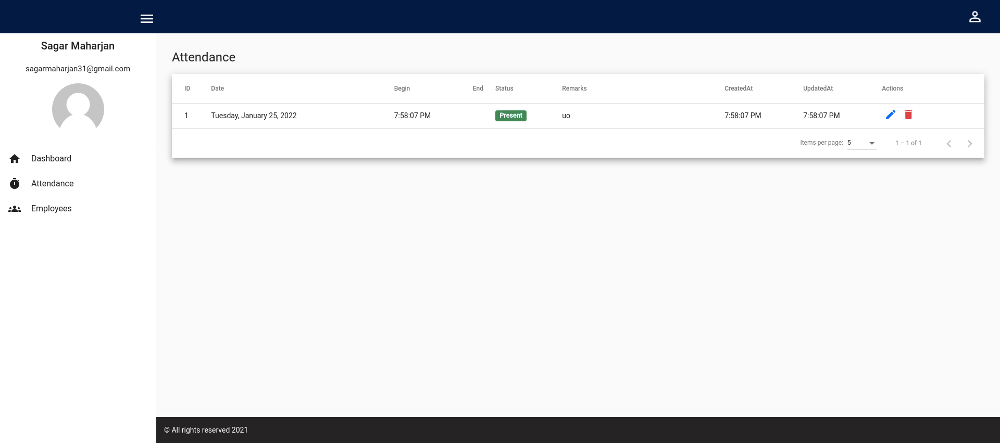

<div id="top"></div>
<!-- PROJECT LOGO -->
<br />
<div align="center">
  <h3 align="center">Employee-Attendance</h3>
</div>

<!-- TABLE OF CONTENTS -->
<details>
  <summary>Table of Contents</summary>
  <ol>
    <li>
      <a href="#about-the-project">About The Project</a>
      <ul>
        <li><a href="#built-with">Built With</a></li>
      </ul>
    </li>
    <li>
      <a href="#getting-started">Getting Started</a>
      <ul>
        <li><a href="#prerequisites">Prerequisites</a></li>
        <li><a href="#installation">Installation</a></li>
      </ul>
    </li>
    <li><a href="#usage">Usage</a></li>
    <li><a href="#contact">Contact</a></li>
  </ol>
</details>


<!-- ABOUT THE PROJECT -->
## About The Project
Employee Attendance is a web application project built with Express(Node.js framework) and Angular where user can submit their attendance, view, update and delete their attendance. 

<p align="right">(<a href="#top">back to top</a>)</p>


### Built With

* [Node.js](https://nodejs.org/en/)
* [MongoDB](https://docs.mongodb.com/)
* [Angular](https://angular.io/)
* [JWT Authorization](https://jwt.io/)
* [Angular Material](https://material.angular.io/)
* [Bootstrap](https://getbootstrap.com)
* [FullCalendar](https://fullcalendar.io/)
* [Moment.js](https://momentjs.com/)


<p align="right">(<a href="#top">back to top</a>)</p>


<!-- GETTING STARTED -->
## Getting Started

To run a local copy up and running follow these simple example steps.

### Prerequisites

* Node v16.10.0(using nvm)
  ```sh
  nvm install v16.10.0 (linux/ubuntu)
  nvm use v16.10.0
  ```
* Angular v13.1.3
  ```sh
  npm install @angular/cli@13.1 -g
  ```
* [MongoDB](https://docs.mongodb.com/manual/tutorial/install-mongodb-on-ubuntu/)

### Installation
1. Clone the repo
   ```sh
   git clone git@github.com:tetrachromat/employee-attendance.git
   ```
2. Install NPM packages for backend
   ```sh
   npm install
   ```
3. Run the backend server
   ```sh
   npm run dev
   ```
4. Install NPM packages for client
    ```sh
   cd client
   npm install
   ```
5. Run the client server
    ```sh
   ng s
   npx ng s(if angular is not installed globally)
   ```
6. To view the application, run the development server https://127.0.0.1:4200/# or https://127.0.0.1:3000/#
<p align="right">(<a href="#top">back to top</a>)</p>


<!-- USAGE EXAMPLES -->
## Usage

|  Login                    |  Submit Attendance        |
| -------------------------:|:------------------------- |
|   |   |

 ```sh
   user credentials
   Admin user
   email: sagar.maharjan@example.com
   password: admin123

   Employee user
   email: john.doe@example.com
   password: user123
   ```


### Dashboard Page
  

  ```sh
    In dashboard page, employee can view their attendance and other attendance as well in calendar view.
  ```

|  Attendance Page          |                           |
| -------------------------:|:------------------------- |
|   |   |
|   | 

```sh
  In attendance page, employee can view, update and delete their attendances.<br/>
  **User attendance with no check_in and check_out date is created through create-attendance job which will run every(sun-fri) day at 00:05 a.m in the backend.**
  **Attendance status 'missed' and 'absent' are being updated through daily update-attendance job which will run every(sun-fri)day at 11:55 p.m in the backend.**
```


|  Employee Page          |                           |
| -------------------------:|:------------------------- |
|   |   |
|   |  |

```sh
  In employee page, admin user can create, view, update and delete employee .
```


<p align="right">(<a href="#top">back to top</a>)</p>

<!-- CONTACT -->
## Contact

Sagar Maharjan - [@my_linkedin](https://www.linkedin.com/in/sagarmaharjan31/) - sagarmaharjan31@gmail.com

<p align="right">(<a href="#top">back to top</a>)</p>
